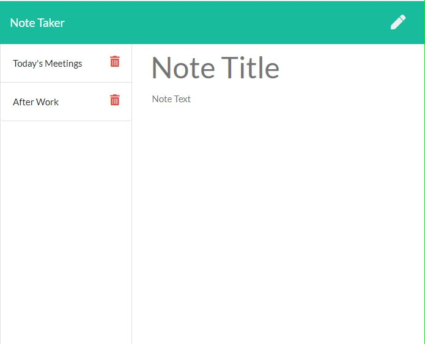

# Note-Taker
 
<h1>Description</h1>
 
The purpose of this application was to be able to write, save and delete notes. This application used express for the backend in order to minipulate data from a JSON file.

This application already had the frontend built out and was to show my backend devloper skills to build out a functional working application using express. 

 
Check out the app! Click the link https://jtcnotetaker.herokuapp.com/ 

<h1>How To</h1>
 
1. Type in the input fields your notes  then click the SAVE icon. 
2. Create more notes as you wish or click on previous notes to view them. 
3. Once the user no longer needs the note you can delete the note by clciking the DELETE button.

